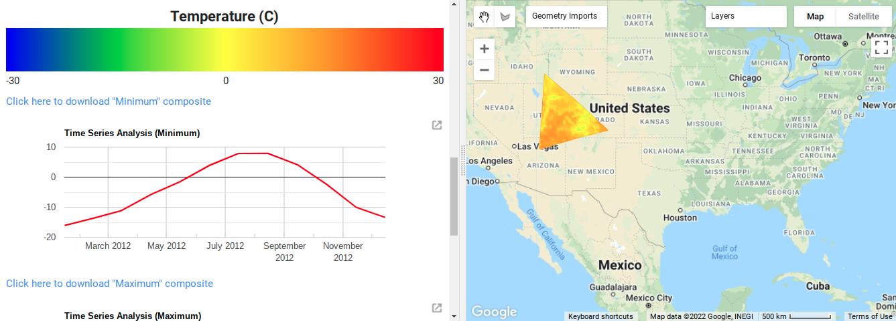

# netcdf-cog-stac

This repository contains example code to convert NetCDF files from an FTP site to COG and STAC files. Specifically, it was designed to convert NetCDF files from [CMIP3 and CMIP5 Climate and Hydrology Projections](https://gdo-dcp.ucllnl.org/). The resulting COG and STAC files can be written to a local directory or to AWS S3. Also included is a Google Earth Engine dashboard that you can use to view and compare composite images, along with code to make it work with COGs.

## Common Setup

Install Anaconda/[Miniconda](https://docs.conda.io/en/latest/miniconda.html) on your machine if you haven't already.

Open a terminal and `cd` into the folder where you've checked out this git repoository. In the following instructions, text in a `fixed-width font` is a command to be entered into the terminal.

Create a new conda environment:

```
conda env create -n netcdf-cog-stac -f conda-environment.yml
```

You'll need to rerun this after creating the environment and in any new terminal:

```
conda activate netcdf-cog-stac
```

Once the environment is activated, you can install the required python dependencies.
You'll need to rerun this if [requirements.txt](requirements.txt) has changed.

```
pip install -r requirements.txt
```

If you'd like the conversion tool to write to S3, configure access keys in either [environment variables or an AWS configuration file](https://boto3.amazonaws.com/v1/documentation/api/latest/guide/configuration.html#using-environment-variables)


## File conversion

The following command will convert a NetCDF file or folder from FTP at `ftp://HOST/FOLDER/FILE` (replace with the actual location) into COG and STAC files on `BUCKET` in S3. Inside the bucket, files will be placed inside a folder named based on the original NetCDF filename, so a source `FILE` of `foo-bar.nc` would create files under `s3://BUCKET/foo-bar/`.
```
python -m netcdf_cog_stac -v ftp://HOST/FOLDER/FILE s3://BUCKET/
```

For example:
```
python -m netcdf_cog_stac -v ftp://gdo-dcp.ucllnl.org/pub/dcp/archive/1950-2099/sresb1/sresb1.bccr_bcm2_0.1.monthly.Prcp.1950-2099.nc s3://your-output-bucket
```

You can get more information about other options for the conversion command by running

```
python -m netcdf_cog_stac --help
```


## Google Earth Engine Dashboard



To use the example dashboard, run the following commands:
```
python -m netcdf_cog_stac -v ftp://gdo-dcp.ucllnl.org/pub/dcp/archive/1950-2099/sresa1b/sresa1b.bccr_bcm2_0.1.monthly.Prcp.1950-2099.nc output
python -m netcdf_cog_stac -v ftp://gdo-dcp.ucllnl.org/pub/dcp/archive/1950-2099/sresa1b/sresa1b.bccr_bcm2_0.1.monthly.Tavg.1950-2099.nc output
```

Upload the contents of the `output` folder into a [Google Cloud Storage (GCS)](https://console.cloud.google.com/storage/) bucket.

To create ImageCollections out of the files in GCS, open the included [Jupyter notebook](google_earth_engine/COG_Backed_Image_Asset_Registration_into_an_ImageCollection.ipynb) into a notebook runner like [Google Colab](https://colab.research.google.com/). Change the variables that have "# CHANGE" comments. Click the Runtime menu, then Run all. You'll be prompted twice to authorize access - once for Google Earth Engine, and once for Google Cloud Platform. You'll run it twice - once with the location of the Prcp data, and once for the Tavg data. 

Paste the contents of [dashboard.js](google_earth_engine/dashboard.js) into the Earth Engine Code Editor, editing the variables at the top of the code as needed to point to the Earth Engine folder that contains the ImageCollections you created. Click Run. You should now be able to interact with your map, following the instructions provided.
